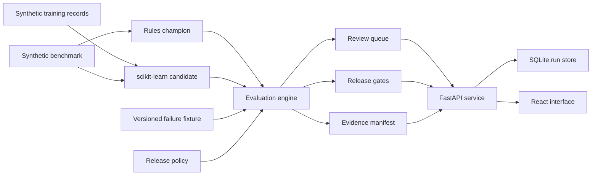

# Architecture

Model Release Lab is a bounded portfolio system for comparing one candidate
model with one champion model. It uses only deterministic synthetic records.
There are no file uploads, external model calls, credentials, or private data
connectors.

## Requirements

The first release must:

- run five guided evaluation scenarios without network access
- keep model metrics separate from the release policy
- show aggregate and segment-level results
- block invalid labels, critical-segment regressions, and excessive review work
- record reviewer overrides and rollbacks with a required reason
- produce a reproducible evidence payload for every run
- remain useful on a phone and accessible with a keyboard

The public demo is intentionally small. It is designed for tens of records per
run, not production traffic or model training at scale.

## Components

The evaluation package does not depend on FastAPI or SQLite. The service layer
orchestrates models and persistence, while the API validates its own bounded
request shapes. This keeps release decisions testable without an HTTP server.

## Data flow

1. A user chooses one allowlisted scenario.
2. The rules champion and TF-IDF logistic-regression candidate score the same
   benchmark records.
3. Some scenarios apply a named, versioned failure fixture to the candidate
   output. The interface labels that injection explicitly.
4. The evaluation engine computes overall metrics, per-segment metrics, review
   reasons, and gate outcomes.
5. SHA-256 digests bind both model specifications, the benchmark, policy,
   review queue, metrics, and gates into a stable evaluation fingerprint.
6. SQLite stores the complete JSON-safe run payload and bounded decision log.

## Storage

SQLite is enough for a single public demo process and keeps local setup simple.
The repository opens one short-lived connection per operation and stores the
run payload as canonical JSON. The demo retains the latest 200 runs to keep a
public, unauthenticated service from growing its local database without bound.
A larger system would normalize model versions,
benchmarks, predictions, reviews, and decisions into separate tables, then use
PostgreSQL with migrations and transaction-level authorization.

## API

- `GET /health`
- `GET /api/scenarios`
- `GET /api/runs`
- `POST /api/runs`
- `GET /api/runs/{run_id}`
- `POST /api/runs/{run_id}/decisions`
- `GET /api/runs/{run_id}/evidence`

Only `override`, `reject`, and `rollback` are accepted decision actions. Every
decision requires a reason between 1 and 300 characters. A blocked run can be
overridden or rejected. A passed or overridden run can be rolled back. Rejected
and rolled-back runs are terminal.

## Reliability and security boundaries

- Scenario IDs and decisions are allowlisted.
- Prediction IDs must match the benchmark exactly.
- Candidate labels are checked against controlled taxonomies.
- The API has no upload, arbitrary-path, shell, or remote-fetch surface.
- Cross-origin development access is limited to local Vite addresses.
- The compiled frontend path is explicit and can be overridden with
  `MODEL_RELEASE_LAB_FRONTEND` for packaged runtimes.
- The public database contains only synthetic data and may reset on redeploy.
- A container build compiles the frontend and serves it from the API process.
- The public host uses ephemeral storage, so run history may also reset after
  an idle spin-down or service restart.

## Growth path

If this became a larger system, the next changes would be a PostgreSQL schema,
immutable object storage for evidence, authenticated reviewer roles, background
evaluation jobs, signed model and dataset registries, and production monitoring.
Those features are out of scope for this public demonstration.
